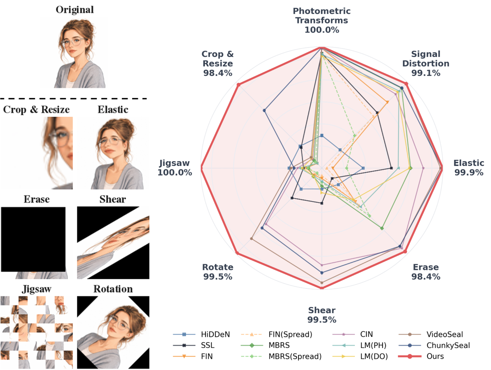
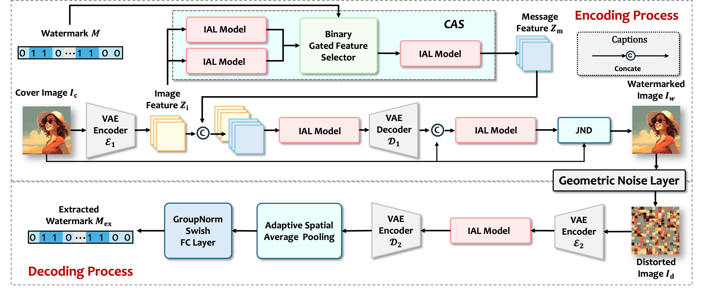

# 🏷️ CASIAL

<p align="center">
  <b>✨ CASIAL: Geometric Distortion Robust Image Watermarking ✨</b>
</p>


<p align="center">
  <a href="#"></a>
  <a href="#"></a>
  <a href="#"></a>
  <a href="#"></a>
</p>


<p align="center">
  <b>👨‍🔬 Yupeng Qiu, Han Fang*, and Ee-Chien Chang</b>
</p>

<p align="center">
  <i>Cover Image-Aware Message Spreading + Invariance Alignment Learning</i>
</p>

---


<p align="center">
  
</p>

---

## 🌟 Overview

**CASIAL** is a robust deep learning-based image watermarking framework for
64-bit blind message embedding. Existing encoder-decoder watermarking methods
often degrade under geometric distortions because spatial correspondence is
broken by cropping, erasing, jigsaw permutation, elastic deformation, shear, and
rotation.

CASIAL addresses this challenge with two core ideas:

- **CAS**: cover image-aware message spreading, which distributes message
  evidence broadly while coupling it to image content.
- **IAL**: invariance alignment learning, which uses spatial attention to
  aggregate displaced evidence and improve decoding under misalignment.

### 📦 What This Repository Provides

- 🔧 The final **CASIAL encoder-decoder** framework.
- 🧠 **CAS** and **IAL** modules for geometric robustness.
- 🎨 **JND-aware watermark attenuation** for perceptual fidelity.
- 🛡️ A unified distortion layer covering signal, geometric, and photometric attacks.
- 📊 Paper-style evaluation scripts that export CSVs and LaTeX rows.

### ⚡ Key Features

| Feature | Description |
|---------|-------------|
| 🔢 **64-bit Capacity** | Embeds 64-bit binary messages into images |
| 🎨 **High Fidelity** | Preserves visual quality through JND-aware attenuation |
| 🧭 **Geometric Robustness** | Handles cropping, erasing, jigsaw, elastic, shear, and rotation |
| 🛡️ **Broad Distortion Coverage** | Supports JPEG, filtering, noise, dropout, and color transforms |
| 📄 **Paper-Ready Testing** | Produces raw metrics, aggregate metrics, logs, and LaTeX rows |

---

## 🏗️ Architecture

<p align="center">
  
</p>

CASIAL follows the encoder-noise-decoder paradigm:

- The **encoder** embeds a 64-bit message into the cover image.
- **CAS** constructs cover-aware message features from image features.
- **IAL** uses spatial attention to align evidence under geometric distortion.
- A **JND attenuation** module suppresses visually sensitive residuals.
- The **decoder** recovers the message from distorted watermarked images.

---

## 🛡️ Supported Distortion Attacks

CASIAL trains with a combined distortion pool and evaluates with the final paper
protocol.

| Noise Type | Abbreviation | Description |
|------------|--------------|-------------|
| 🧩 Crop and Resize | `RC` | Crops a region and resizes it back |
| 🧽 Erasing | `Erase` | Removes a random region |
| 🧱 Jigsaw | `Jigsaw` | Permutes image blocks |
| 🌊 Elastic Deformation | `Elastic` | Applies nonrigid spatial deformation |
| 🔁 Rotation | `Rotate` | Rotates the image |
| ↔️ Shear | `Shear` | Applies affine shear |
| 🎞️ JPEG Compression | `KJPEG` / `JpegTest` | Simulates JPEG degradation |
| 🧊 Median Filter | `MF` | Applies median filtering |
| 🌫️ Gaussian Filter | `GF` | Applies Gaussian blur |
| 🎲 Dropout | `Dropout` | Randomly drops pixels |
| 🧂 Salt & Pepper | `SP` | Adds impulse noise |
| 📈 Gaussian Noise | `GN` | Adds additive Gaussian noise |
| 🌈 Photometric Changes | `Hue` / `Bright` / `Contrast` / `Saturation` | Changes color and tone |

---

## 📥 Installation

```bash
# Clone your repository
git clone https://github.com/your-username/CASIAL.git
cd CASIAL

# Install dependencies
pip install torch torchvision kornia einops numpy pillow
```

### 📋 Requirements

- 🐍 Python >= 3.8
- 🔥 PyTorch >= 1.9
- 📷 torchvision
- 🧮 kornia
- 🧩 einops
- 🔢 NumPy
- 🖼️ Pillow

> The repository is self-contained: model definitions and distortion layers are
> included under `network/`.

---

## 🚀 Quick Start

### 1️⃣ Prepare Data

CASIAL expects flat image folders:

```text
your_dataset/
├── train/
│   ├── image_0001.png
│   └── ...
└── test/
    ├── image_0001.png
    └── ...
```

Update the dataset paths in:

```json
{
  "dataset_path": "/path/to/your_dataset"
}
```

for training, and:

```json
{
  "data_root": "/path/to/your_dataset/test"
}
```

for testing.

The default configs intentionally leave these paths empty so users can set their
own local dataset locations.

### 2️⃣ Prepare Checkpoint

Model weights are not tracked in Git. Download the pretrained CASIAL checkpoint
and place it locally:

> 💾 **Pretrained checkpoint:** [`300.pt`](https://drive.google.com/file/d/1fOi15BFPv1kKj7q8WlJetZwttMcfFrvu/view?usp=share_link)

```bash
mkdir -p checkpoints
cp /path/to/300.pt checkpoints/300.pt
```

### 3️⃣ Train

```bash
python train.py --config configs/train.json --output runs/casial_final
```

For a quick smoke test:

```bash
python train.py --config configs/train.json --output runs/smoke --max-steps 2
```

The training script will:

- 💾 Save checkpoints under `runs/<name>/checkpoints/`
- 📊 Log training metrics including accuracy, PSNR, and loss
- ✅ Validate at regular intervals

### 4️⃣ Evaluate

```bash
python test.py \
  --config configs/test.json \
  --checkpoint checkpoints/300.pt \
  --output outputs/final_table
```

The evaluator writes:

```text
df_raw.csv       # raw per-distortion results
df_paper.csv     # paper-ready rows after symmetric averaging
df_agg.csv       # clean PSNR and average robustness
val_log.txt      # compact text log
latex_row.tex    # one LaTeX table row
```

---

## 💾 Pretrained Models

Download the pretrained checkpoint from Google Drive and place it under
`checkpoints/`:

> 🔗 [`300.pt`](https://drive.google.com/file/d/1fOi15BFPv1kKj7q8WlJetZwttMcfFrvu/view?usp=share_link)

```text
checkpoints/
└── 300.pt
```

The default evaluation command loads `checkpoints/300.pt`. Large checkpoint
files are ignored by Git, so the repository stays lightweight.

---

## 📊 Results

We evaluate CASIAL under signal distortions, geometric transforms, and
photometric transforms. Accuracy values are reported as percentages (%).

### 🎨 Visual Quality & 💪 Robustness

| Method | PSNR | JPEG | C&R | Shear | Rotate | Jigsaw | AVG |
|--------|:----:|:----:|:---:|:-----:|:------:|:------:|:---:|
| **CASIAL** | **40.82** | **96.70** | **99.22** | **99.52** | **99.48** | **100.00** | **99.48** |

### 🔍 Key Observations

- ✅ CASIAL maintains high visual fidelity while embedding 64-bit messages.
- ✅ CASIAL is especially robust under challenging geometric distortions.
- ✅ The same evaluation script reproduces paper-table metrics and LaTeX rows.

---

## ⚙️ Training Configuration

Default training settings are stored in `configs/train.json`:

| Setting | Value |
|---------|-------|
| Image size | `128 x 128` |
| Message length | `64` bits |
| Training subset | `10%` |
| Batch size | `16` |
| Learning rate | `1e-6` |
| Encoder weight | `30` |
| Decoder weight | `1` |
| Watermark alpha | `1.0` |
| JND attenuation | enabled |

The training entrypoint enables all training distortions from the first batch.
It does not expose curriculum scheduling.

---

## 📏 Evaluation Metrics

| Metric | Meaning |
|--------|---------|
| `acc` | Bit accuracy |
| `bit_error` | `1 - acc` |
| `psnr` | Cover image vs clean watermarked image |
| `final_psnr` | Cover image vs distorted watermarked image |

`test.py` uses deterministic 64-bit messages: the same image index receives the
same message under the same seed.

---

## 📁 Project Structure

```text
CASIAL/
├── assets/
│   ├── model_architecture.png      # architecture figure
│   └── robustness_radar.png        # robustness radar figure
├── casial/
│   ├── model.py                    # CASIAL model wrapper
│   ├── noise.py                    # noise builders
│   ├── jnd.py                      # JND attenuation
│   ├── metrics.py                  # accuracy and PSNR
│   ├── data.py                     # flat-folder dataset
│   ├── eval.py                     # final-table evaluation
│   └── checkpoint.py               # checkpoint helpers
├── network/
│   ├── Encoder.py                  # encoder architecture
│   ├── Decoder.py                  # decoder architecture
│   ├── blocks.py                   # network building blocks
│   └── noise_layers/               # concrete distortion implementations
├── checkpoints/                    # local checkpoints, ignored by Git
├── configs/
│   ├── train.json
│   └── test.json
├── train.py
├── test.py
└── README.md
```

---

## 🧹 Git Hygiene

The `.gitignore` excludes:

- 💾 checkpoints: `*.pth`, `*.pt`, `*.ckpt`
- 📁 experiment outputs: `runs/`, `results/`, `outputs/`
- 🧪 temporary noise files and caches
- 📊 generated CSV/log files

Commit source code, configs, figures, and documentation only.

---

## 📝 Citation

If you find this work useful, please cite our paper:

```bibtex
@article{qiucasial,
  title={CASIAL: Image Watermarking Robust to Geometric Distortions},
  author={Qiu, Yupeng and Fang, Han and Chang, Ee-Chien},
  journal={},
  year={}
}
```

---

## 📬 Contact

For questions or issues, please open a GitHub issue or contact:

- 👨‍💻 **Yupeng Qiu** - [qiu_yupeng@u.nus.edu](mailto:qiu_yupeng@u.nus.edu)
